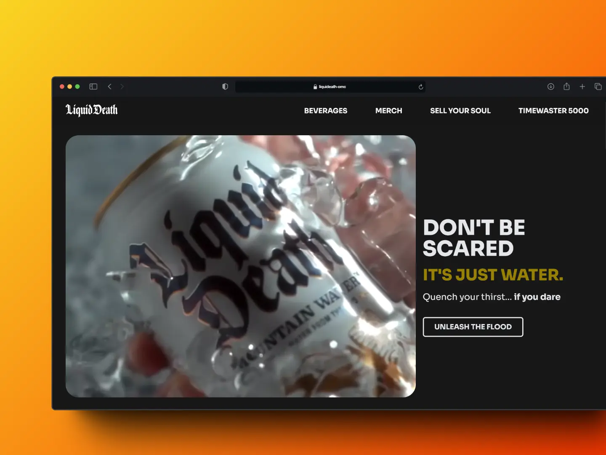
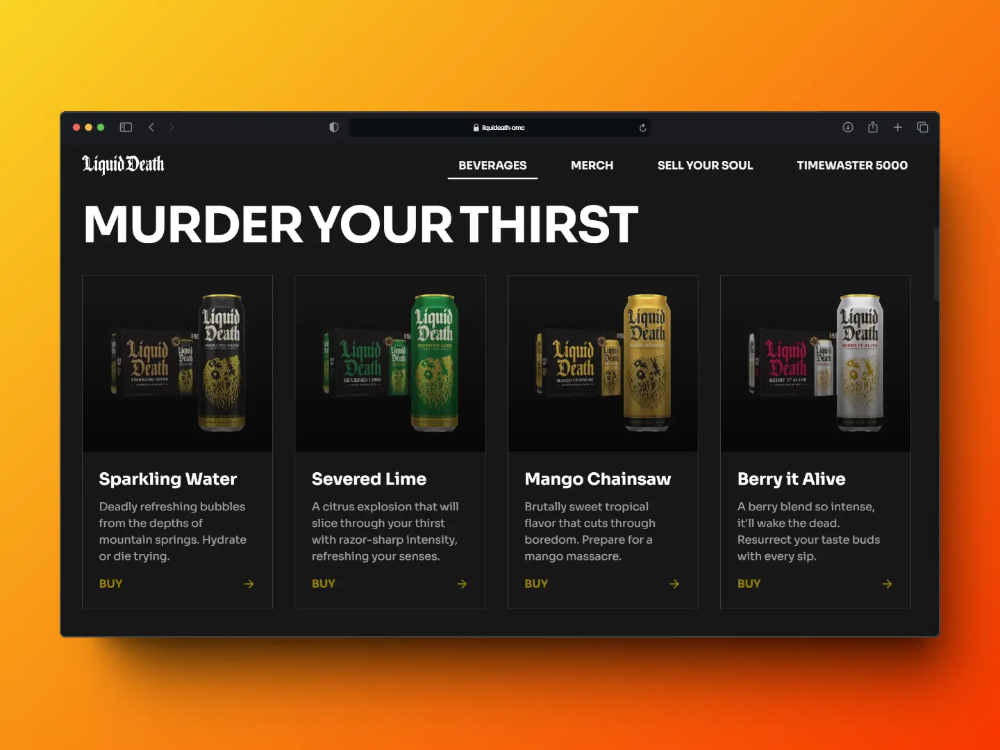
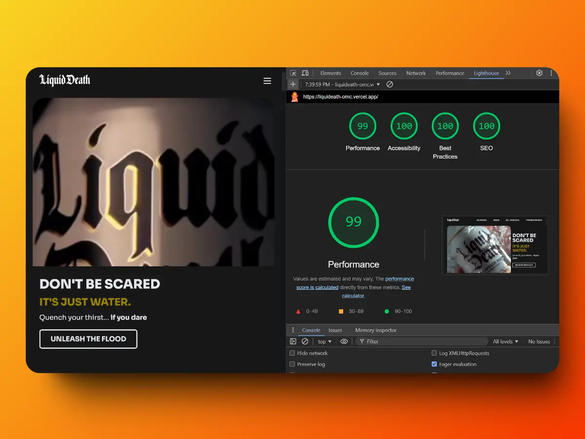

# 🌊💀 Liquid Death Landing Page Redesign

## 📜 About This Project

This project is a creative redesign of the Liquid Death landing page. It aims to capture the essence of the brand while exploring new design possibilities and user experiences. Built with modern web technologies, this redesign showcases the power of combining Astro, Tailwind CSS, React, and Framer Motion.





## 🚀 Getting Started

To view or use this project in development, follow these steps:

1. Clone the repository

   ``` bash
   git clone https://github.com/oriolmontcreus/liquideath.git
   ```

2. Install dependencies

   ``` bash
   npm install
   ```

3. Run the development server

   ``` bash
   npm run dev
   ```

4. Open your browser and navigate to `http://localhost:4321`

## 🛠️ Built With

- [Astro](https://astro.build/) - Static Site Generator
- [Tailwind CSS](https://tailwindcss.com/) - Utility-first CSS framework
- [React](https://reactjs.org/) - JavaScript library for building user interfaces
- [Framer Motion](https://www.framer.com/motion/) - Animation library for React

## 🧪 Open Source & Inspiration

This project is completely open source! Feel free to draw inspiration, fork, or adapt the code for your own projects. However, we kindly ask that you follow these guidelines:

1. 🏷️ Give credit to this personal project in your README or documentation
2. 🎭 Acknowledge the original Liquid Death brand as the inspiration

## ⚠️ Asset Usage Notice

Please note that all visual assets (images, logos, etc.) used in this project are the property of the official Liquid Death brand. These assets are used here for demonstration purposes only. If you fork or adapt this project, ensure you do correct use of these assets.

## 🌟 Acknowledgements

- [Liquid Death](https://liquiddeath.com/) - For their amazing brand, inspiration, and visual assets

## 📝 License

This project is licensed under the MIT License - see the [LICENSE](LICENSE) file for details.

## 📞 Contact

[Oriol Mont Creus](https://bento.me/omont-dev) - <omcdev9@gmail.com>

---

⚡️ Made with murderous mountain water and a splash of creativity ⚡️
